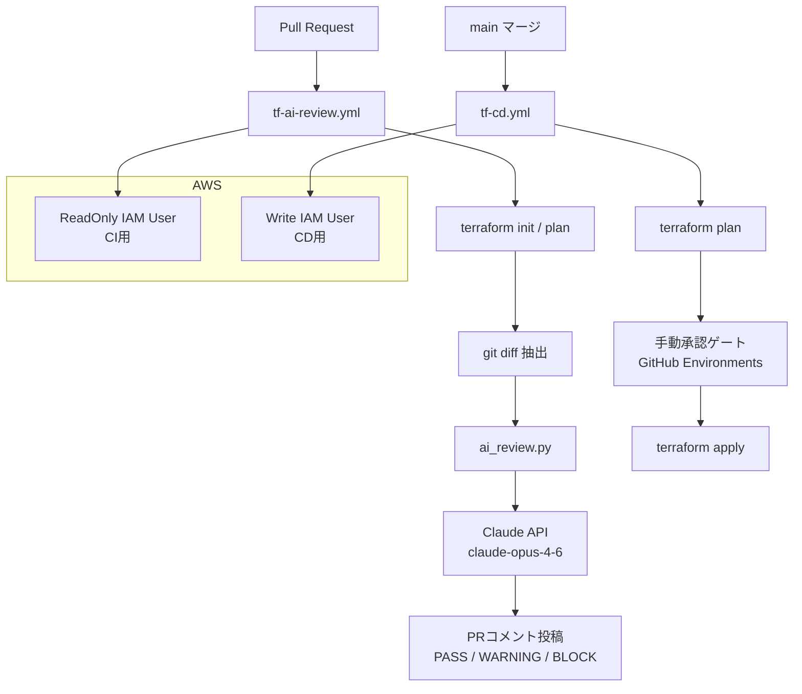

# Terraform AI Review

GitHub ActionsとClaude AIを使って、TerraformコードをPRマージ前に自動レビューするCI/CDパイプライン。

## 概要

プルリクエストが作成されると、Terraform planの差分をClaude AIが解析し、セキュリティリスク・コスト影響・運用上の問題・ベストプラクティス違反を検出してPRコメントとして投稿します。

```
PASS / WARNING / BLOCK のいずれかで判定
```

## アーキテクチャ



## パイプライン構成

### Phase 1 — CI パイプライン (`tf-ai-review.yml`)

| ステップ | 内容 |
|---|---|
| トリガー | PR作成・更新時 |
| 認証 | AWS ReadOnly IAM ユーザー |
| 処理 | `terraform init` → `plan` → diff抽出 → AI解析 |
| 出力 | PRコメントにレビュー結果を投稿 |

### Phase 2 — CD パイプライン (`tf-cd.yml`)

| ステップ | 内容 |
|---|---|
| トリガー | mainブランチへのマージ後 |
| 認証 | AWS 書き込み権限 IAM ユーザー |
| 処理 | `terraform plan` → 手動承認 → `terraform apply` |
| 承認 | GitHub Environments + Required Reviewers |

## ディレクトリ構成

```
terraform-ai-review/
├── .github/
│   ├── workflows/
│   │   ├── tf-ai-review.yml   # CI: PRレビューワークフロー
│   │   └── tf-cd.yml          # CD: applyワークフロー
│   └── scripts/
│       └── ai_review.py       # Claude API呼び出し・PRコメント投稿
├── main.tf                    # サンプルTerraformコード
└── README.md
```

## セットアップ

### 1. AWS IAM 設定

**CI用（読み取り専用）**

```bash
aws iam create-user --user-name tf-ai-review-readonly
aws iam attach-user-policy \
  --user-name tf-ai-review-readonly \
  --policy-arn arn:aws:iam::aws:policy/ReadOnlyAccess
aws iam create-access-key --user-name tf-ai-review-readonly
```

**CD用（書き込み権限）**

```bash
aws iam create-user --user-name tf-ai-review-apply
# 必要なポリシーをアタッチ
aws iam create-access-key --user-name tf-ai-review-apply
```

### 2. GitHub Secrets 設定

リポジトリの `Settings → Secrets and variables → Actions` に以下を登録：

| Secret名 | 用途 |
|---|---|
| `ANTHROPIC_API_KEY` | Claude API認証 |
| `AWS_ACCESS_KEY_ID` | CI用ReadOnly IAMアクセスキー |
| `AWS_SECRET_ACCESS_KEY` | CI用ReadOnly IAMシークレットキー |

CD用の認証情報は GitHub Environments に別途設定。

### 3. GitHub Environments 設定（CD用）

`Settings → Environments → New environment` で `production` を作成し、Required Reviewers を設定する。

## AIレビューの判定基準

| 判定 | 意味 |
|---|---|
| `PASS` | 問題なし。マージ可 |
| `WARNING` | 注意が必要な変更あり。確認推奨 |
| `BLOCK` | 重大なリスクあり。マージ非推奨 |

チェック項目：

- セキュリティリスク（過剰な権限付与、パブリック公開設定など）
- コスト影響（高コストリソースの追加・変更）
- 運用上の問題（単一障害点、バックアップ未設定など）
- ベストプラクティス違反（命名規則、タグ付けなど）

## 使用技術

- [GitHub Actions](https://docs.github.com/ja/actions)
- [Anthropic Claude API](https://docs.anthropic.com/) (`claude-opus-4-6`)
- [Terraform](https://www.terraform.io/)
- AWS IAM

